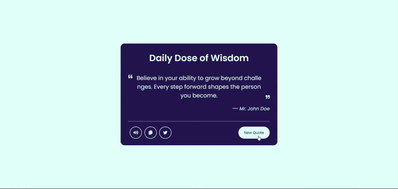
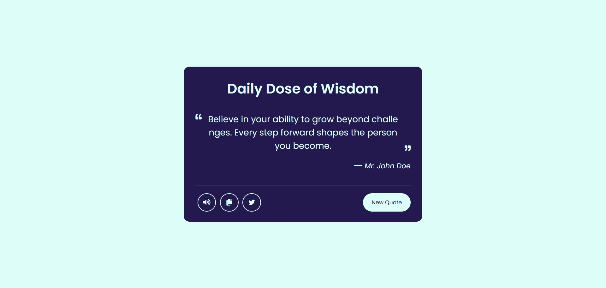
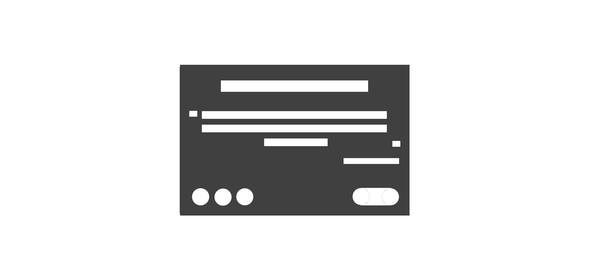
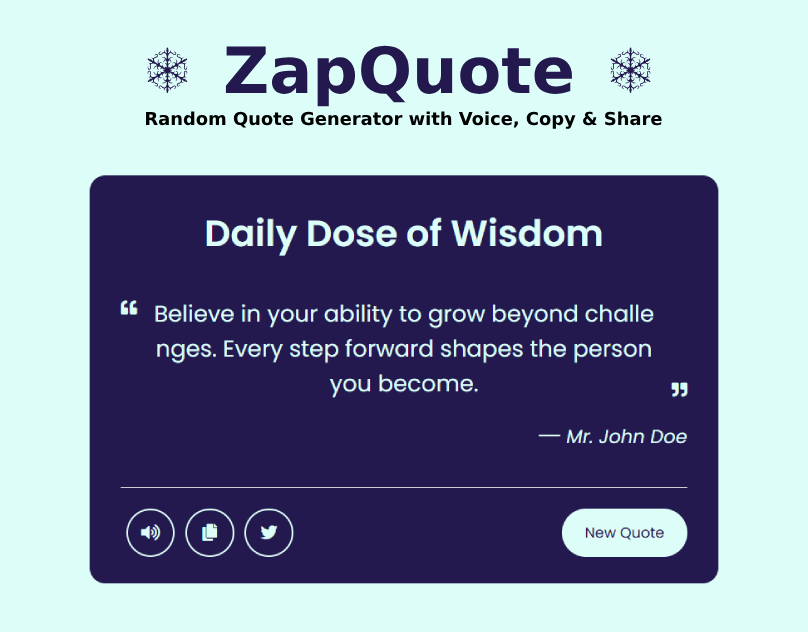

# 🔥 ZapQuote

**ZapQuote** is a sleek and interactive random quote generator built with **HTML, CSS, and JavaScript**. With each click of the "New Quote" button, it delivers a fresh, inspirational quote. Plus, it features text-to-speech functionality, easy copying, and instant Twitter sharing.

## 🚀 Features

- 🔁 Get a new random quote with every click
- 🔊 Convert quotes to speech with a single button
- 📋 Copy quotes to your clipboard
- 🐦 Share quotes instantly on Twitter

## 🛠️ Technologies Used

- HTML5
- CSS3
- JavaScript (ES6)
- [Quotable API](https://github.com/lukePeavey/quotable)

## 📡 API Used

This project uses the **[Quotable API](https://github.com/lukePeavey/quotable)** – a free, open-source quotations API. It was originally built as part of a FreeCodeCamp project.

> If you're interested in contributing to the Quotable API, please check out the [Contributors Guide](https://github.com/lukePeavey/quotable/blob/master/CONTRIBUTING.md).

## 💡 How to Use

1. Clone or download the repository.
2. Open `index.html` in your browser.
3. Click the **New Quote** button to generate quotes.
4. Use the **Speaker**, **Copy**, or **Twitter** buttons for more interactivity.

## 📁 Folder Structure

ZapQuote/
│
├── index.html
├── style.css
└── app.js

 
Design Previews 

 
Design 

 
Design UI UX Layout 

 
Cover Design 
